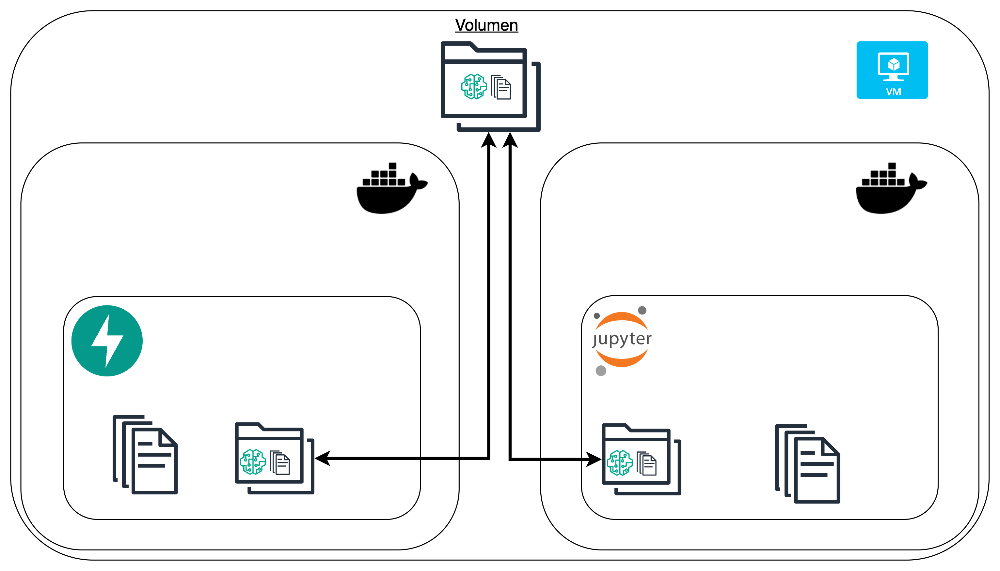
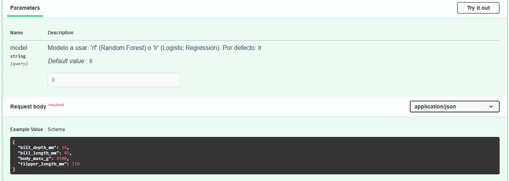
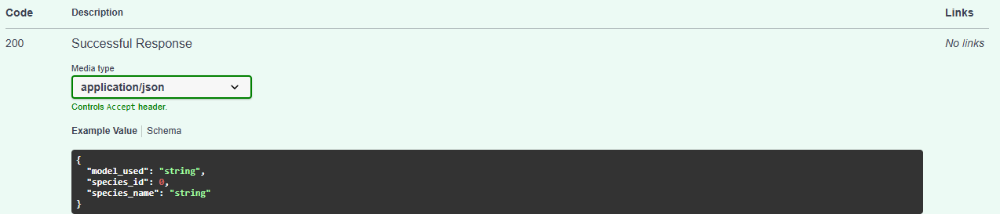

# Taller 2 — Ambiente de Desarrollo ML con Docker, UV y JupyterLab

## Introducción

En este taller construimos un ambiente de desarrollo para Machine Learning usando **Docker Compose**, **UV** y **JupyterLab**. El objetivo fue crear un entorno donde un científico de datos pueda entrenar modelos en un notebook y exponerlos automáticamente a través de una API REST, sin necesidad de reiniciar servicios ni copiar archivos manualmente.

La clave del proyecto es un **volumen compartido**: una carpeta en el disco local que ambos contenedores (Jupyter y la API) ven al mismo tiempo. Cuando un modelo es guardado desde el notebook, la API lo puede consumir de inmediato en el siguiente request.



---

## Arquitectura

```
ml-workspace/
├── docker-compose.yml        ← orquesta los dos servicios
├── jupyter/
│   ├── Dockerfile            ← imagen con JupyterLab + scikit-learn (via uv)
│   └── pyproject.toml        ← dependencias del entorno de entrenamiento
├── api/
│   ├── Dockerfile            ← imagen con FastAPI + uvicorn (via uv)
│   ├── pyproject.toml        ← dependencias de la API
│   └── main.py               ← lógica de inferencia
├── models/                   ← volumen compartido entre ambos contenedores
│   └── .gitkeep
└── notebooks/                ← notebooks persistentes de entrenamiento
```

**Flujo de datos:**

```
[JupyterLab] → entrena modelo → guarda .joblib en models/
                                         ↓ (mismo volumen)
[FastAPI]    → recibe request → lee .joblib → devuelve predicción
```

---

## Requisitos previos

Antes de comenzar asegúrate de tener instalado en tu computadora:

- [Docker Desktop](https://www.docker.com/products/docker-desktop/) (incluye Docker Compose)
- [Visual Studio Code](https://code.visualstudio.com/)
- Git (opcional, para control de versiones)

Puedes verificar que Docker está instalado con:

```powershell
docker --version
docker compose version
```
---

## Configurar los archivos
Los archivos clave son:

### `docker-compose.yml`
Define los dos servicios (`jupyter` y `api`), el volumen compartido (`./models`) y la red interna que los conecta.

### `jupyter/Dockerfile`
Usa la imagen oficial de Python 3.12 e instala todas las dependencias mediante **UV**, un gestor de paquetes ultra rápido para Python. Arranca JupyterLab en el puerto `8888`.

### `api/Dockerfile`
Similar al anterior pero instala FastAPI y uvicorn. Arranca la API en el puerto `8000` con `--reload` activado para detectar cambios automáticamente.

### `api/main.py`
Contiene tres endpoints:
- `GET /` — estado de la API
- `GET /models` — lista los modelos disponibles en el volumen
- `POST /predict` — realiza inferencia (acepta parámetro `?model=rf` o `?model=lr`)

---

## Levantar el ambiente

Desde la carpeta `ml-workspace` en tu terminal:

```powershell
docker compose up --build
```
Cuando veas estas líneas en la terminal, todo está listo:

```
ml-jupyter  |  http://127.0.0.1:8888/lab?token=...
ml-api      |  INFO:     Uvicorn running on http://0.0.0.0:8000
```

**Accesos:**
- JupyterLab → http://localhost:8888 (token: `dev123`)
- API docs → http://localhost:8000/docs

---

## Entrenar los modelos en JupyterLab

Abre http://localhost:8888, ingresa el token `dev123`

Entrenamos dos modelos para predecir la especie de un pingüino usando el dataset **Palmer Penguins**:

- **Random Forest** → 97.01% accuracy
- **Logistic Regression** → 100% accuracy

Las features utilizadas son:

| Feature | Descripción |
|---|---|
| `bill_length_mm` | Largo del pico en mm |
| `bill_depth_mm` | Profundidad del pico en mm |
| `flipper_length_mm` | Largo de la aleta en mm |
| `body_mass_g` | Masa corporal en gramos |

Las especies posibles son: **Adelie**, **Chinstrap** y **Gentoo**.

Al finalizar el entrenamiento, los modelos se guardan directamente en el volumen compartido.

---

## Consumir la API

Abre http://localhost:8000/docs. Verás la documentación interactiva generada automáticamente por FastAPI (Swagger UI).

### Listar modelos disponibles

`GET /models` devuelve los modelos que hay en el volumen:

```json
{
  "available_models": [
    "penguins_random_forest.joblib",
    "penguins_logistic_regression.joblib"
  ],
  "default": "lr"
}
```

### Realizar una predicción

`POST /predict` con parámetro opcional `?model=lr` o `?model=rf`:

**Request body:**
```json
{
  "bill_length_mm": 45.0,
  "bill_depth_mm": 14.0,
  "flipper_length_mm": 210.0,
  "body_mass_g": 4500.0
}
```

**Response:**
```json
{
  "model_used": "penguins_logistic_regression.joblib",
  "species_id": 2,
  "species_name": "Gentoo"
}
```

Si no especificas el modelo, usa **Logistic Regression** por defecto.




---

## Cómo funciona el volumen compartido

El volumen es el mecanismo central de este proyecto. No es una sincronización ni una copia, es literalmente **la misma carpeta** vista desde dos lugares:

```
Tu PC: ml-workspace/models/
    ↕ montada en ambos contenedores como /home/app/models
Jupyter: /home/app/models/
API:    /home/app/models/
```

Esto significa que cuando guardas un modelo desde el notebook, **el siguiente request a la API ya usa el modelo nuevo** sin necesidad de reiniciar nada, porque la API carga el archivo en cada request.

## Conclusión

En este taller demostramos cómo Docker Compose permite construir ambientes de desarrollo reproducibles y modulares para proyectos de Machine Learning. Con solo un comando (`docker compose up --build`) levantamos un entorno completo con JupyterLab para entrenar modelos y una API REST para consumirlos, conectados mediante un volumen compartido.

El uso de **UV** como gestor de paquetes garantiza instalaciones rápidas y reproducibles. La arquitectura de volumen compartido elimina fricciones en el ciclo de desarrollo: entrenas, guardas, y la API responde con el modelo actualizado de inmediato.

Este patrón es la base de ambientes MLOps más robustos donde se pueden incorporar herramientas como MLflow para tracking de experimentos, bases de datos para logging de predicciones, o sistemas de monitoreo de modelos en producción.
